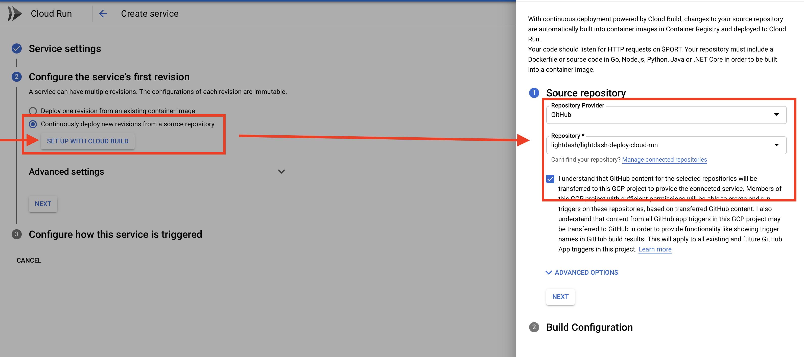
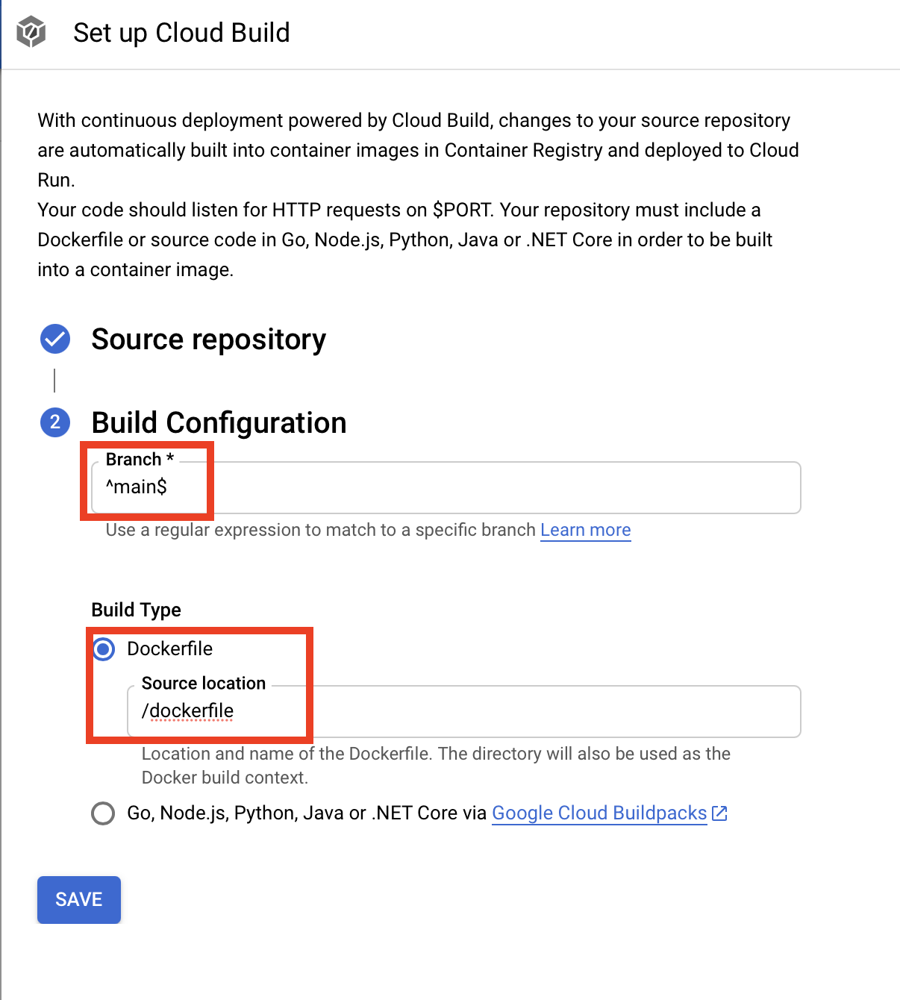
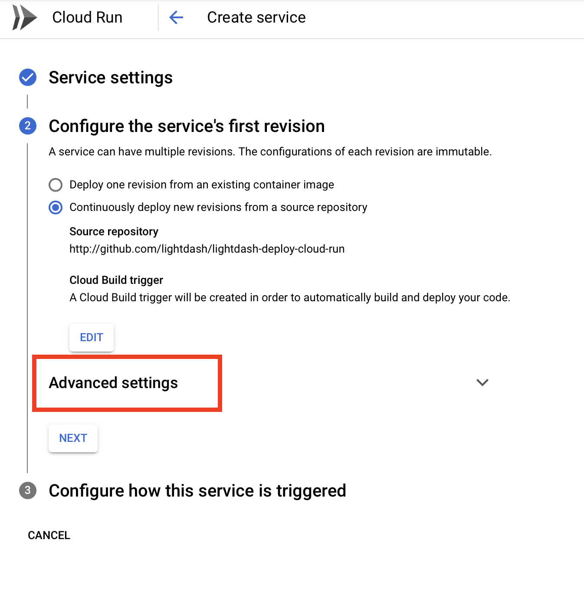

# Deploy a Lightdash project with GCP Cloud Run

This repo shows you how to deploy your dbt project with Lightdash to GCP Cloud Run.

## 1. Add three extra files to your dbt repo

This directory is a standard dbt project repo with 3 extra files:
- `lightdash-dockerfile`: you need to create your own simple dockerfile to deploy Lightdash with your dbt project
- `lightdash-entrypoint.sh`: (optional) - an optional script if you need to run any dbt commands before deploying lightdash
- `profiles/profiles.yml`: credentials to access your data warehouse

```
.
├── data/
├── dbt_project.yml
├── lightdash-dockerfile
├── lightdash-entrypoint.sh
├── models/
└── profiles
    └── profiles.yml
```

## 2. Configure `profiles.yml`

Your `profiles.yml` should contain a profile matching the profile in your `dbt_project.yml`. Do not put secrets in here
instead use the `env_var` function. You can see an example in this repo.

**Bigquery tip** - by default cloud run can access bigquery, so you don't need to pass any credentials (see the `./profiles.yml` in this repo)

## 3. Configure Cloud Run to deploy from your repo

Now you can use this repo to launch a Cloud Run container using Docker. The steps below show you how to do this with the GCP UI using the github integration.

### 3.1 Create a new service

[https://console.cloud.google.com/run](https://console.cloud.google.com/run)


### 3.2 Link to github repo

Select "Deploy continuously... from a source repository" and point it to your github repo. Select your branch and the name of the docker file (in our case it's `lightdash-dockerfile`




### 3.3 Update container configuration

Hit advanced settings and check the port is set to `8080`. Also set minimum instances to 1: Lightdash is slow to startup so it's better to keep it live.




### 3.4 Update secrets

Set environment variables to populate all the values of your `profiles.yml` file that use the `env_var` function.

In our example we don't consider these secrets so we add them under "environment variables". However, if you need to pass database passwords or other secrets to your `profiles.yml` file, then you can use the "secrets" functionality.


### 3.5 Setup network access

In our example we just make it public. You may want to run it in a VPC, like your internal company network.


